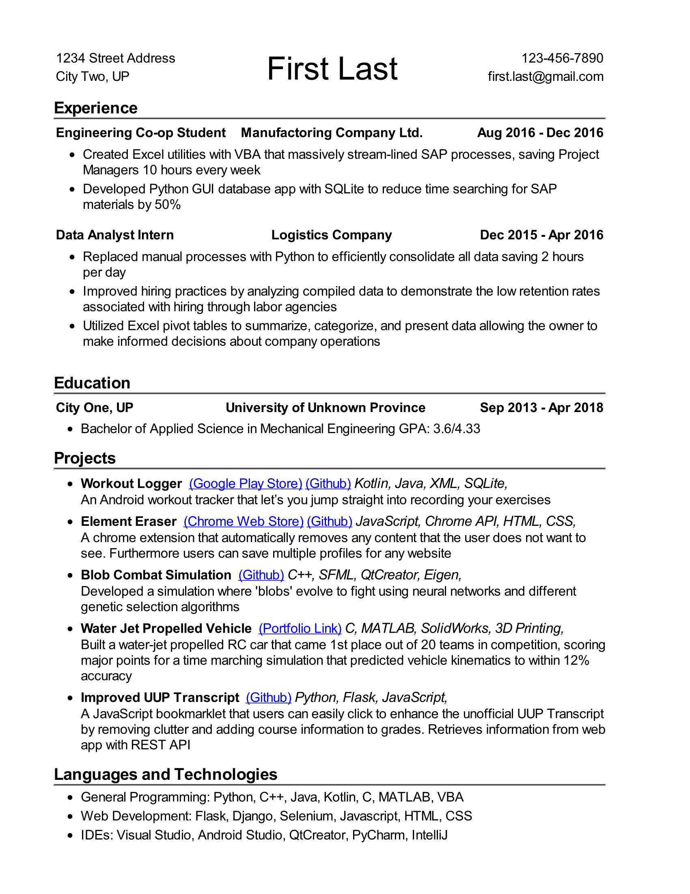

# ResumeGenerator
Generate a PDF resume formatted as perscribed by [Gayle McDowell from CareerCup, author of Cracking The Coding Interview](https://www.careercup.com/resume)
using a YAML schema.
Here's a preview 
## Instructions

### Setup resume.yaml
See the example [resume.platf.yaml](resumes/resume.platf.yaml) in the `resumes/`
directory.

### Clone Repo and Setup
```bash
git clone https://github.com/arashout/ResumeGenerator.git
cd ResumeGenerator
uv init
uv add pyyaml jinja2 weasyprint argparse
```

### Generate PDF resume from command-line
You can generate your pdf resume by running:
```bash
uv run python main.py resumes/resume.platf.yaml -o resume
```
Optionally you can anonymize your PDF by supplying a second argument:
```bash
uv run python main.py resumes/resume.platf.yaml -o resume -a path/to/anon_data.yaml
```
Where `anon_data.yaml` is a dictionary where the keys are sensitive information
you want to replace and the values are generic text to replace them with
e.g.
```yaml
    "Arash Outadi": "First Last" 
    "arash.out@gmail.com": "first.last@gmail.com"
    UBC: UA
    "University of British Columbia": "University of Anons"

    London: UKCity
    Vancouver: CADCity
    BC: CADProv

    Ravelin: Fintech Startup
    Andritz: Pulp & Paper
    "Canadian Logistics": "Logistics Company"
```

#### CareerCup Template
If you don't really care about the CLI tool and just want the HTML template, navigate to the CareerCup directory and you'll find the Jinja2 HTML template and the styles.css stylesheet.

## Examples
An example of a resume is inside `resumes` folder
